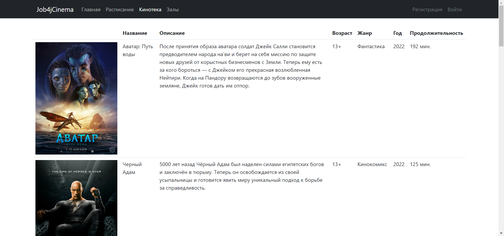

# Кинотеатр

## О проекте

**Проект представляет собой web-приложение по покупке билетов в кинотеатр. Сервис состоит из:**

* главной страницы, которая выводит общую информацию о ресурсе;
* кинотеки, которая содержит список всех фильмов, находящихся в кинопрокате;
* списка залов, где можно ознакомиться с информации о залах в кинотеатре;
* расписания, которое позволяет выбрать сеанс и связанный с ним фильм. Затем перейти на страницу покупки билета, где,
  указав предпочтительный ряд и место, приобрести билет, либо отказаться от покупки;
* страницы регистрации и авторизации пользователя.

## Инструменты

- **Java 17**
- **Spring Boot 2.7.6**
- **PostgreSQL 14**
- **Spring Security 5**
- **Hibernate**
- **HTML 5**
- **CSS**
- **Thymeleaf 2.7.6**
- **Bootstrap 4.4.1**
- **H2database 1.4.2**
- **Commons-dbcp2 2.9.0**
- **Slf4j**
- **Lombok**
- **Junit 5**
- **Mockito 4.8.0**
- **Liquibase 4.15.0**
- **Maven 3.8**
- **Git**

## Сборка и запуск<br>

- **Создать БД**

``` shell 
create database cinema;
```

- **Запустить проект по команде**

``` shell 
mvn spring-boot:run -Pproduction
```

- **Перейти в браузере по ссылке**

``` shell 
http://localhost:8080/
```

## Взаимодействие с приложением<br>

### Главная страница web-приложения:


### Страница с доступными киносеансами:

- При нажатии на название фильма, будет выполнен переход к списку фильмов для ознакомления с описанием фильма.
- При нажатии на название кинозала, будет выполнен преход к списку кинозалов.
- При нажатии на "купить билет", будет выполнен переход на страницу с покупкой билета (покупка возможна только после
  авторизации пользователя).


### Страница со всеми доступными фильмами и их описание:



### Страница с кинозалами и их описание:


### Страница с регистрацией нового пользователя:


### Страница с авторизацией пользователя:


### Страница с возможностью покупки билета:

- Покупка билета возможна только после авторизации пользователя!
- При выборе ряда или места отображается выпадающий список.
- Покупка билета успешна, только если место свободно. <br/>


### Страница с успешной покупкой билета:


### Страница с покупкой билета, если данное место уже занято:


## Контакты для связи<br>

<a href="https://t.me/OvercomingJunk" target="blank"></a>

