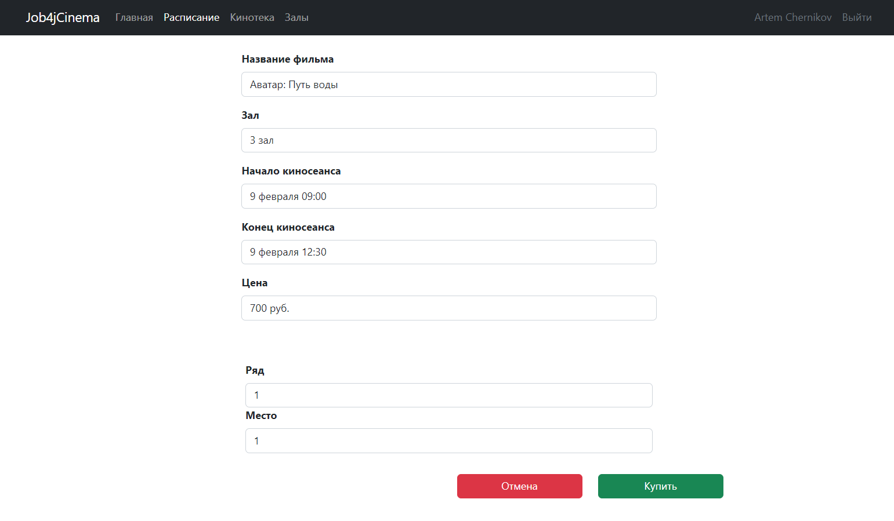

# Кинотеатр

## О проекте

**Проект представляет собой микросервисное web-приложение по покупке билетов в кинотеатр. Сервис состоит:**

* микросервиса, который получает фильмы из kinopoisk API и сохраняет фильмы в БД
* микросервиса, который отвечает за UI часть web-приложения
* микросервиса eureka-server для Spring Cloud окружения
* микросервиса api-gateway для единой точки входа всех REST сервисов

### UI приложения

UI приложения включает в себя следующие компоненты:

- **Главная страница**
  - Выводит общую информацию о ресурсе.
- **Кинотека (Пользователь)**
  - Содержит список всех фильмов, находящихся в кинопрокате.
- **Кинотека (Админ)**
  - Содержит список всех фильмов, находящихся в кинопрокате.
  - Кнопка админа для создания нового киносеанса
- **Список залов**
  - Позволяет ознакомиться с информацией о залах в кинотеатре.
- **Расписание**
  - Позволяет выбрать сеанс и связанный с ним фильм.
  - Переход на страницу покупки билета, где можно указать предпочтительный ряд и место для покупки билета или отказаться от покупки.
- **Страница регистрации и авторизации пользователя**
  - Позволяет пользователю зарегистрироваться или авторизоваться в системе.

## Инструменты

- **Java 20**
- **Spring Boot 3.3.0**
- **PostgreSQL 14**
- **Spring Security 6**
- **Spring Cloud**
- **Eureka**
- **Hibernate**
- **RestTemplate**
- **Docker**
- **Mapstruct**
- **HTML 5**
- **CSS**
- **Thymeleaf**
- **Bootstrap**
- **H2database**
- **Commons-dbcp2**
- **Slf4j**
- **Lombok**
- **Junit 5**
- **Mockito**
- **Liquibase**
- **Maven 3.8**
- **Git**

## Сборка и запуск<br>

### Docker:

- **В терминале (в корне проекта) запустить команду для выполнения сборки проекта**

``` shell 
./mvnw clean install
```

- **В терминале (в корне проекта) запустить команду для старта приложения в docker контейнерах**

``` shell 
docker-compose up
```

- **Перейти в браузере по ссылке**

``` shell 
http://localhost:8080/
```

### Если отсутствует Docker:

- **Создать БД PostgreSQL**

``` shell 
create database films;
create database cinema;
```

- **В терминале (в корне проекта) запустить команду для выполнения сборки проекта**

``` shell 
./mvnw clean install
```

- **Изменить параметры конфигурации БД под свои**

    **Пути к файлам для изменений:**  
    ***./film-service/src/main/resources/application.properties***  
    ***./cinema-main-service/src/main/resources/application.properties***<br></br>

    Заменяем знаки вопросов на свои параметры (username и password):
``` shell 
spring.datasource.username=${SPRING_DATASOURCE_USERNAME:???}
spring.datasource.password=${SPRING_DATASOURCE_PASSWORD:???}
```

- **В терминале (по пути ./film-service) запустить команду для старта приложения**

``` shell 
./mvnw spring-boot:run
```

- **В терминале (по пути ./cinema-main-service) запустить команду для старта приложения**

``` shell 
./mvnw spring-boot:run
```

- **Перейти в браузере по ссылке**

``` shell 
http://localhost:8080/
```

## Взаимодействие с приложением<br>

### Главная страница web-приложения:


### Страница со всеми доступными фильмами и их описание (Пользователь):

- При нажатии на постер фильма будет или на кнопку "подробнее" будет выполнен переход страницу с подробным описанием фильма


### Страница со всеми доступными фильмами и их описание (Админ):

- При нажатии на постер фильма будет или на кнопку "подробнее" будет выполнен переход страницу с подробным описанием фильма
- Админ имеет возможность создать новый киносеанс к фильму, кликнув на кнопку "создать киносеанс"


### Модальное окно с возможностью добавления киносеанса (Админ):


### Страница с подробным описанием фильма:


### Страница с доступными киносеансами:

- При нажатии на "купить билет", будет выполнен переход на страницу с покупкой билета (покупка возможна только после
  авторизации пользователя).


### Страница с кинозалами и их описание:


### Страница с регистрацией нового пользователя:


### Страница с авторизацией пользователя:


### Страница с возможностью покупки билета:

- Покупка билета возможна только после авторизации пользователя!
- При выборе ряда или места отображается выпадающий список.
- Покупка билета успешна, только если место свободно. <br/>



### Страница с успешной покупкой билета:


### Страница с покупкой билета, если данное место уже занято:


## Контакты для связи<br>

<a href="https://t.me/OvercomingJunk" target="blank"></a>

